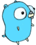

# Jump Jump Game - 跳一跳游戏

一个使用 Go 语言和 Ebiten 游戏引擎开发的跳跃平台游戏，类似于"跳一跳"的玩法。

[](https://golang.org/)
[](https://ebiten.org/)
[](LICENSE)

## 🎮 游戏介绍

这是一个充满挑战性的跳跃游戏，玩家需要控制角色在各种平台间跳跃，获取尽可能高的分数。游戏具有物理引擎、连击系统和特殊平台等丰富功能。



## ✨ 特色功能

- 🎮 **物理引擎驱动**：真实的重力和跳跃物理模拟
- 🎯 **精确控制**：按住蓄力，松开跳跃
- 🌟 **连击系统**：连续成功跳跃获得额外加分
- 🎵 **特殊平台**：音乐盒、便利店、魔方、窨井盖等多种平台类型
- 💨 **动态效果**：流畅的角色动画和跳跃轨迹
- 📈 **难度递增**：游戏随着进度逐渐增加挑战性
- 🎨 **视觉效果**：支持多种操作系统和高分辨率显示

## 🕹️ 游戏玩法

### 操作方式
- **鼠标左键** 或 **R键**：按住蓄力，松开跳跃
- **游戏重启**：游戏结束后重新开始

### 平台类型
- **普通平台**：基础跳跃平台，+1 分
- **音乐盒平台** (音乐符号)：+40 分
- **便利店平台** (便利店)：+15 分  
- **魔方平台** (魔方)：+10 分
- **窨井盖平台** (井盖)：+20 分

### 评分系统
- 基础跳跃：+1 分
- 粘合跳跃 (平台中心)：连击倍数递增
- 特殊平台：额外奖励分数

## 🛠️ 技术架构

### 使用的技术栈
- **Go**: 主编程语言
- **Ebiten**: 2D 游戏引擎，支持 OpenGL 2.1 或更高版本的图形卡
- **go:embed**: 静态资源嵌入
- **golang.org/x/image**: 图像处理库

### 核心功能模块
- **Player**: 玩家角色控制和物理状态管理
- **Platform**: 平台类型和碰撞检测
- **Game**: 游戏状态管理和主循环
- **Physics**: 重力、跳跃和碰撞物理引擎

## 📋 安装要求

- Go 1.23.3 或更高版本
- 支持 OpenGL 2.1 或更高版本的图形卡

## 🚀 快速开始

### 克隆项目
```bash
git clone https://github.com/wwcchh0123/testrepo.git
cd testrepo
```

### 安装依赖
```bash
go mod download
```

### 运行游戏
```bash
go run .
```

## 📁 项目结构

```
.
├── main.go            # 主游戏逻辑
├── embed.go           # 游戏资源嵌入
├── go.mod             # Go 模块依赖
├── go.sum             # 依赖校验文件
├── images/            # 游戏图片资源
│   ├── player.png     # 玩家角色图片
│   ├── bullet.png     # 子弹图片 (预留)
│   └── enemy.png      # 敌人图片 (预留)
├── testfile/          # 测试文件
│   └── test.go
├── .github/           # GitHub Actions 工作流
│   └── workflows/
│       ├── ci.yml     # 持续集成
│       └── claude.yml # Claude 自动化
└── README.md          # 项目文档
```

## 🔧 开发与构建

### 开发环境设置
```bash
# 确保 Go 版本
go version

# 安装依赖
go mod tidy

# 运行开发版本
go run .
```

### 构建发布版本
```bash
# 构建当前平台
go build -o jump-game

# 交叉编译 Windows
GOOS=windows GOARCH=amd64 go build -o jump-game.exe

# 交叉编译 macOS
GOOS=darwin GOARCH=amd64 go build -o jump-game-mac
```

### 构建 Web 版本 (实验性)
```bash
# 需要安装 Ebiten 的 Web 支持
GOOS=js GOARCH=wasm go build -o game.wasm
```

## 🖼️ 游戏截图

游戏包含精美的像素风格图形和流畅的动画效果。角色会根据移动方向自动翻转，摄像机会平滑跟随玩家。

## 🤝 贡献指南

欢迎贡献代码！请遵循以下步骤：

1. Fork 这个仓库
2. 创建功能分支 (`git checkout -b feature/amazing-feature`)
3. 提交更改 (`git commit -m 'Add some amazing feature'`)
4. 推送到分支 (`git push origin feature/amazing-feature`)
5. 创建 Pull Request

### 开发规范
- 遵循 Go 语言编码规范
- 添加适当的注释和文档
- 确保代码通过所有测试
- 保持代码简洁和可读性

## 📄 许可证

本项目基于 MIT 许可证开源。详见 [LICENSE](LICENSE) 文件。

## 🔗 相关链接

- [Ebiten](https://ebiten.org/) - 优秀的 Go 2D 游戏引擎
- [Go 官网](https://golang.org/) - 强大的编程语言
- [项目 Issues](https://github.com/wwcchh0123/testrepo/issues) - 问题反馈和建议

## 📧 联系方式

如果遇到问题或想要建议，请通过 GitHub Issues 联系我们。

---

**享受游戏！** 🎮

## 📝 更新日志

### v1.0.0 (当前版本)
- ✅ 基础跳跃游戏机制
- ✅ 多种特殊平台类型
- ✅ 物理引擎和碰撞检测
- ✅ 评分系统和连击功能
- ✅ 跨平台支持

### 🔮 未来规划
- 🔄 添加更多平台类型
- 🎵 背景音乐和音效
- 🏆 成就系统
- 💾 最高分保存
- 🌍 多语言支持